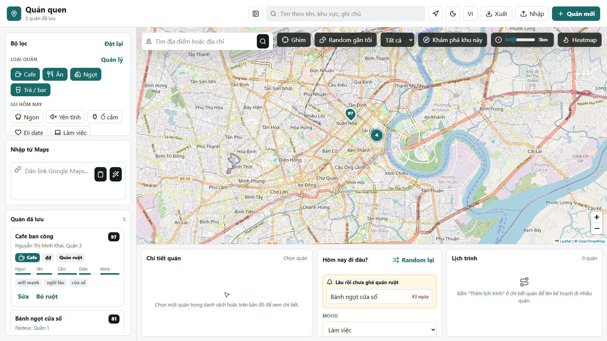
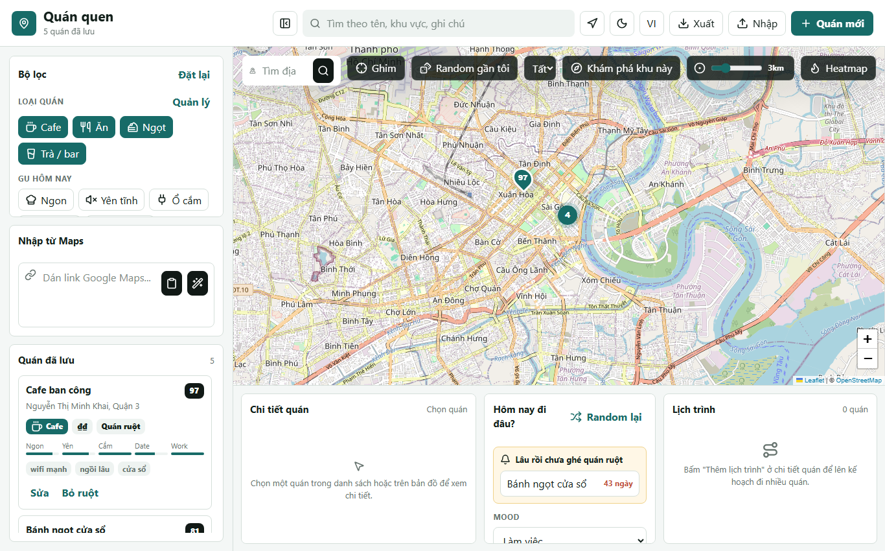
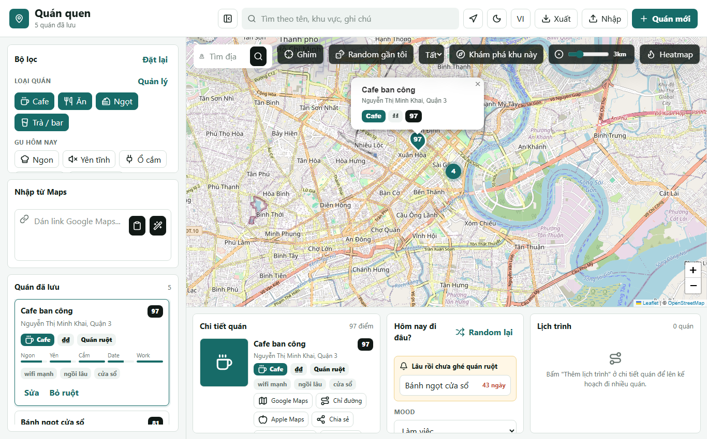
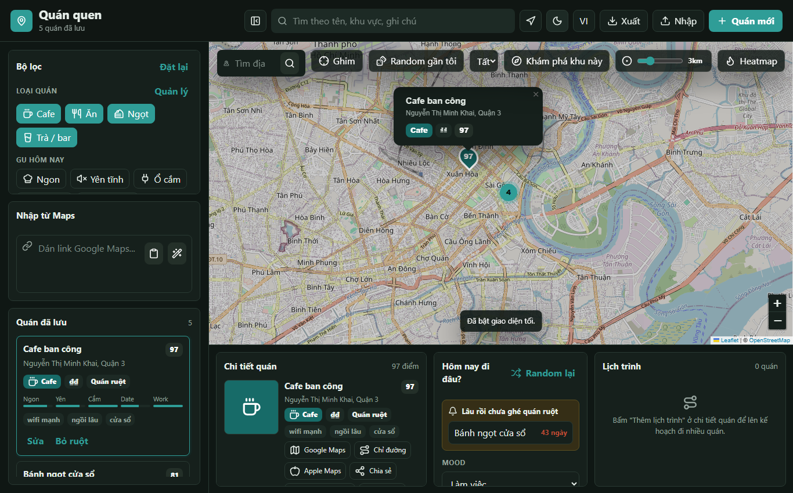

# Quán quen 🗺️

[](https://github.com/tridpt/taste-map/actions/workflows/ci.yml)
[](LICENSE)

> **Sổ tay quán ăn/cafe trên bản đồ, theo gu cá nhân.** Lưu lại những quán quen của bạn — ngon, yên tĩnh, có ổ cắm, hợp đi date, hợp làm việc — rồi để app gợi ý "hôm nay đi đâu", chỉ đường, lên lịch trình và khám phá quán mới quanh bạn.

**Dành cho ai:** người hay đi cafe/quán ăn, muốn một nơi riêng tư (dữ liệu nằm trong trình duyệt của bạn, không tài khoản, không server) để ghi lại và tra cứu quán theo cảm nhận của chính mình — thứ mà Google Maps không làm được.

🔗 **Demo:** https://tridpt.github.io/taste-map/ *(cần bật GitHub Pages cho repo)*

## Demo



## Ảnh chụp

| Giao diện sáng | Chi tiết quán | Giao diện tối |
|---|---|---|
|  |  |  |

## Tài liệu

| File | Nội dung |
|---|---|
| [FEATURES.md](FEATURES.md) | Danh sách đầy đủ tính năng |
| [DOCUMENTATION.md](DOCUMENTATION.md) | Tài liệu kỹ thuật: kiến trúc, mô hình dữ liệu, hàm chính, mở rộng |
| [TEST_CHECKLIST.md](TEST_CHECKLIST.md) | Checklist test nhanh |
| [HUONG_DAN_TEST.md](HUONG_DAN_TEST.md) | Hướng dẫn test thủ công từng bước |
| [CONTRIBUTING.md](CONTRIBUTING.md) | Quy ước đóng góp |

## Công nghệ

Vanilla JS (không framework, không bundler) · Leaflet + markercluster + heat · Lucide icons · PWA (service worker) · lưu trữ localStorage + IndexedDB · song ngữ VI/EN. Dữ liệu quán thật từ OpenStreetMap (Overpass/Nominatim), định tuyến qua OSRM.

**Trình duyệt hỗ trợ:** Chrome / Edge / Firefox / Safari bản mới (cần hỗ trợ ES2020, IndexedDB, Service Worker).

## Chạy local

```powershell
cd D:\AI_App\quan-quen-map
python -m http.server 5178
```

Mở `http://localhost:5178`.

App lưu dữ liệu trong `localStorage` của trình duyệt. Nút `Xuất` tạo file JSON sao lưu, nút `Nhập` khôi phục từ file JSON.

## Tính năng chính

- Lọc quán theo loại, gu, tag riêng và tìm kiếm tự do.
- Quản lý tag: đổi tên hoặc xóa tag đồng loạt trên tất cả quán.
- Thêm loại quán tùy chỉnh ngoài 4 loại mặc định (cafe, ăn, ngọt, trà/bar); xóa loại tùy chỉnh sẽ chuyển quán liên quan về Cafe.
- Lọc theo khoảng giá (₫–₫₫₫₫) và bán kính khoảng cách bằng thanh trượt, kèm lọc theo khu vực (tự gom theo quận/huyện từ địa chỉ).
- Lập lịch trình nhiều quán: thêm quán vào lịch trình, sắp xếp thứ tự, xem tuyến đi thật theo đường phố (qua OSRM, tự lùi về đường chim bay khi offline) kèm quãng đường và thời gian, mở chỉ đường đa điểm trên Google Maps và lưu lịch trình theo tên để dùng lại.
- Gom quán thành bộ sưu tập tùy chỉnh (đi date, làm việc...) và lọc theo bộ sưu tập.
- Bật lớp heatmap để xem mật độ quán trên bản đồ thay cho marker.
- Lọc nhanh `Đang mở cửa` để chỉ hiện quán đang mở ngay lúc này dựa trên giờ mở cửa đã lưu, hoặc chọn ngày và giờ định đi để xem quán nào mở vào khung giờ đó.
- Nút chỉ đường mở thẳng Google Maps hoặc Apple Maps từ vị trí hiện tại tới quán.
- Nút `Chia sẻ` dùng Web Share API trên điện thoại, tự fallback copy thông tin quán kèm link Google Maps trên máy tính.
- Nút đổi giao diện sáng/tối trên thanh công cụ; lựa chọn được lưu trong trình duyệt và tự theo cài đặt hệ thống ở lần đầu.
- Bấm vị trí hiện tại để hiện khoảng cách tới từng quán và sắp xếp `Gần tôi nhất`.
- Nút `Khám phá khu này` quét OpenStreetMap quanh tâm bản đồ và hiện tất cả quán trong bán kính chọn được (thanh trượt 1–10km) để duyệt và lưu, không cần định vị.
- Nút `Random gần tôi` khám phá quán mới quanh bạn từ bản đồ (OpenStreetMap/Overpass), lọc theo loại (cafe, quán ăn, bar, ngọt) và hiện nhiều kết quả để chọn kèm nút lưu nhanh; nếu offline thì gợi ý ngẫu nhiên trong danh sách đã lưu.
- Marker trên bản đồ tự gom cụm khi nhiều quán nằm gần nhau, bấm vào cụm để phóng to xem từng quán.
- Gợi ý `Hôm nay đi đâu?` theo mood: làm việc, đi date, yên tĩnh, ăn nhanh, ăn ngon, gần tôi, và `Mới chưa thử` để ưu tiên quán chưa ghé lần nào.
- Nhắc các quán ruột đã lâu chưa ghé ngay trong khu gợi ý.
- Lưu ảnh quán trực tiếp trong trình duyệt; ảnh được lưu riêng trong IndexedDB (chỉ giữ id/album trong `localStorage` để tránh đầy) và phân loại theo album (món, không gian, menu, khác); panel chi tiết hiển thị ảnh theo từng album, bấm để xem ảnh lớn (lightbox).
- Lưu giờ mở cửa thủ công theo ngày trong tuần và hiển thị `Đang mở` / `Có thể đóng`.
- Lưu lịch sử ghé quán theo ngày, điểm và ghi chú.
- Form nhập quán là hộp thoại có quản lý bàn phím: tự đưa focus vào form, giữ focus trong form khi bấm Tab, đóng bằng Escape và trả focus về nút mở.
- Panel `Thống kê` tổng hợp tổng số lần ghé, quán ghé nhiều nhất, điểm trung bình theo loại quán và biểu đồ số lần ghé 6 tháng gần đây.

## Dữ liệu và sao lưu

- App nhắc xuất backup nếu chưa backup hoặc đã quá 7 ngày.
- Ảnh quán lưu trong IndexedDB; `localStorage` chỉ giữ dữ liệu quán dạng văn bản nên khó đầy, có cảnh báo khi dung lượng `localStorage` gần đầy, và ảnh mồ côi được tự dọn khi khởi động.
- `Backup mã hóa` tạo file JSON dùng PBKDF2 + AES-GCM, cần mật khẩu để khôi phục.
- `JSON thường` tạo file backup không mã hóa để dễ kiểm tra/chỉnh tay.
- `Nhập CSV` / `Xuất CSV` cho phép nhập hàng loạt và xuất danh sách quán ra file CSV (cột: name, type, address, lat, lng, price, tags, notes, favorite).
- Có thể đồng bộ cloud tùy chọn qua GitHub Gist bằng token có quyền `gist`; token và Gist ID lưu trong trình duyệt của bạn.
- Các thao tác thêm/sửa/xóa/import/pull có nút `Hoàn tác` trong vài giây sau khi thực hiện.

## Nhập từ Google Maps

Dán URL Google Maps vào ô `Dán link Google Maps` trên bản đồ để app tự lấy tên và tọa độ khi URL có dạng đầy đủ. App hỗ trợ các URL có `@lat,lng`, `!3dlat!4dlng`, hoặc tham số `q/query=lat,lng`. Link rút gọn như `maps.app.goo.gl` cần mở ra trước rồi copy URL đầy đủ vì trình duyệt không cho app tự mở rộng link đó.

Có thể dán nhiều link, mỗi dòng một link; app sẽ tạo hàng chờ để xác nhận trước khi lưu. Nút clipboard đọc link đang copy trong trình duyệt hỗ trợ Clipboard API. Khi cài như PWA, app khai báo `share_target` để nhận link được chia sẻ từ điện thoại.

## PWA

App có `manifest.json` và `sw.js`, nên có thể cài như ứng dụng khi chạy qua HTTP/HTTPS. Service worker cache app shell, thư viện bản đồ, plugin gom cụm marker, icon và các tile bản đồ đã xem. Khi offline, dữ liệu quán đã lưu vẫn dùng được; tìm địa điểm mới qua OpenStreetMap cần có mạng.

Khi trình duyệt hỗ trợ, nút `Cài app` sẽ hiện trên thanh công cụ. Khi service worker tải được bản mới, nút `Cập nhật` sẽ hiện để kích hoạt bản mới đúng lúc.

## Kiểm tra
```powershell
npm install
npm run check
npm test
```

Playwright test kiểm tra app render, import Google Maps, backup mã hóa, undo, đổi giao diện sáng/tối, đa ngôn ngữ VI/EN, lọc đang mở cửa, lọc giá/khu vực, lịch trình và định tuyến OSRM, thống kê chi tiêu, nhập CSV, bộ sưu tập, heatmap, ảnh IndexedDB, dọn ảnh mồ côi, đồng bộ Gist (mock) và PWA manifest. `npm run check` cũng kiểm tra UTF-8 để tránh lưu nhầm mojibake. Xem `TEST_CHECKLIST.md` cho danh sách test thủ công.

GitHub Actions tự chạy các bước này khi push lên `main`. Job `deploy-pages` chỉ chạy sau khi `checks` pass, nên Pages không deploy nếu JavaScript, manifest, encoding hoặc Playwright test bị lỗi. Trong Settings -> Pages, chọn source là `GitHub Actions` để dùng luồng deploy có kiểm tra này.
